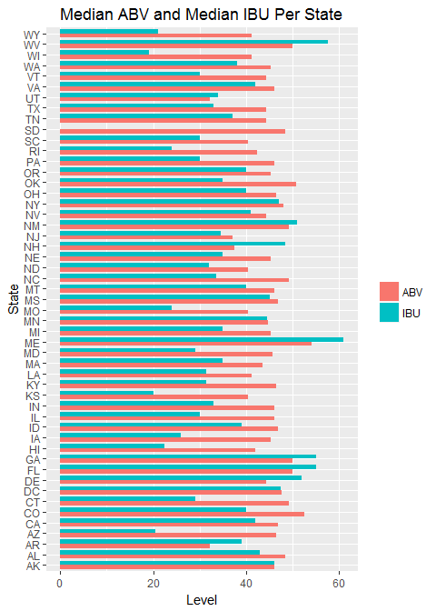
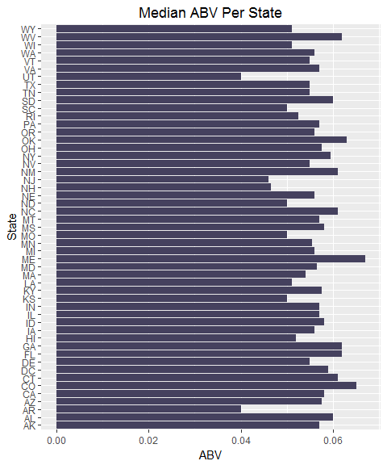
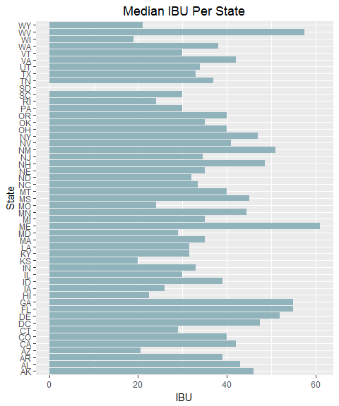
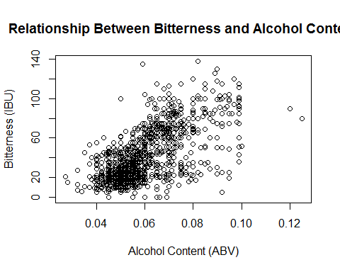
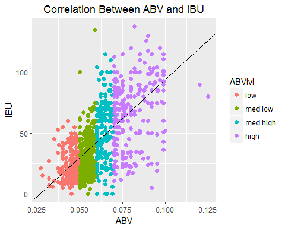

# An Analysis of Characteristic Relationships of Craft Beer
Claudia Woodruff & Jeff Weltman  
October 12, 2017  


## Overview

W&W Analytics has been commissioned by *Stars, Stripes, and Beer Co.* to analyze the Craft Beer market in the United States and to determine any associative relationship between primary beer characteristics.

The owners would like to grow their business and would like any insight we may provide to enable them to make the best decisions to increase their market share. Specifically, they would like to have a better understanding of the relationship between ABV and IBU across each of the 50 states in the United States.  They suspect that refining the ABV and IBU levels of their craft beers would be key to gaining more market share of the craft beer segment.

## Project Description
W&W Analytics has been commissioned by *Stars, Stripes, and Beer Co.* - hereafter referred to as *SS&B* - to analyze a sample of the craft beer market in order to answer the following research questions:

* How many breweries are present in each state?
* What is the median alcohol content (ABV) for each state? 
* What is the median international bitterness unit (IBU) for each state?
* Which state has the maximum alcoholic (ABV) beer?
* Which state has the most bitter (IBU) beer?
* Is there any apparent relationship between the bitterness of the beer and its alcoholic content?

#### Hypothesis
In this study we will determine whether there is an associative relationship between ABV and IBU levels in beer.

#### Observational Study
As this is an observational study, we note that any conclusions drawn from the data can only be inferred as associative within the scope of this sample population. 

This research is therefore not intended to support such conclusions as, for example, a higher ABV *causes* a higher IBU. Instead the findings might indicate that evidence suggests *an association* between ABV and IBU.

## Study Design and Data Processing
The study was designed to be a representative sample of craft breweries, both large and small, across all 50 states of the United States of America. The data, obtained by the client, was consolidated from disparate sources into these two data files.

These data were collected from public domain sources. The sources are known to be reputable and include *ratebeer.com*, *Brewer's Association* websites, and social media. 


```r
Beers <- "https://raw.githubusercontent.com/jeffweltman/StarsStripesAndBeer/master/Raw/Beers.csv" 
DFBeers <- repmis::source_data(Beers)
```

```
## Downloading data from: https://raw.githubusercontent.com/jeffweltman/StarsStripesAndBeer/master/Raw/Beers.csv
```

```
## SHA-1 hash of the downloaded data file is:
## d3e3e8f8e9cf27e0df038f47ccfcfc2dfccf4217
```

```r
#SHA-1 hash of the downloaded data file is:
#  d3e3e8f8e9cf27e0df038f47ccfcfc2dfccf4217

Breweries <- "https://raw.githubusercontent.com/jeffweltman/StarsStripesAndBeer/master/Raw/Breweries.csv"
DFBreweries <- repmis::source_data(Breweries)
```

```
## Downloading data from: https://raw.githubusercontent.com/jeffweltman/StarsStripesAndBeer/master/Raw/Breweries.csv
```

```
## SHA-1 hash of the downloaded data file is:
## 4579c1fc92624c25cb2643d7e61c542972fdc7ab
```

```r
#SHA-1 hash of the downloaded data file is:
#  4579c1fc92624c25cb2643d7e61c542972fdc7ab
```


## Method

### Data Tidying
Our raw data required some tidying, which is common with this type of data. First, we renamed variable names in order to aid in merging the two files.


```r
colnames(DFBeers) <- c("BeerName","Beer_ID","ABV","IBU","Brewery_ID","Style","Ounces")
colnames(DFBreweries) <- c("Brewery_ID","BreweryName","City","State")
```

We discovered that there were many incomplete records in the raw data sets, likely due to the dependency on self-reported information. Therefore, some data tidying was necessary. There were numerous observations with missing ABV and/or IBU values. As the analysis was dependent upon these values, these observations were not included in this study. We chose to remove the observations after We merge the data sets. North Dakota was an exception, as an IBU value was missing from all ND observations. To avoid omitting all ND beers from the study, we set their IBU value to zero rather than deleting the observations completely.  


```r
colSums(is.na(DFBeers))      # DFBeers has 1,005 observations with IBU of NA but will be removed after merge
```

```
##   BeerName    Beer_ID        ABV        IBU Brewery_ID      Style 
##          0          0         62       1005          0          0 
##     Ounces 
##          0
```

```r
colSums(is.na(DFBreweries))  # DFBreweries has no NA
```

```
##  Brewery_ID BreweryName        City       State 
##           0           0           0           0
```

We also checked for outliers. The standard deviation for the ABV variables was low, concluding there were no outliers of concern. Although the standard deviation for the IBU measurement was quite high at over 25, we did not remove any outliers based on IBU as research indicates that IBU values do typically have a wide range. 
(ref: https://www.brewersfriend.com/2017/05/07/beer-styles-ibu-chart-2017-update/)


```r
summary(DFBeers)
```

```
##    BeerName            Beer_ID            ABV               IBU        
##  Length:2410        Min.   :   1.0   Min.   :0.00100   Min.   :  4.00  
##  Class :character   1st Qu.: 808.2   1st Qu.:0.05000   1st Qu.: 21.00  
##  Mode  :character   Median :1453.5   Median :0.05600   Median : 35.00  
##                     Mean   :1431.1   Mean   :0.05977   Mean   : 42.71  
##                     3rd Qu.:2075.8   3rd Qu.:0.06700   3rd Qu.: 64.00  
##                     Max.   :2692.0   Max.   :0.12800   Max.   :138.00  
##                                      NA's   :62        NA's   :1005    
##    Brewery_ID       Style               Ounces     
##  Min.   :  1.0   Length:2410        Min.   : 8.40  
##  1st Qu.: 94.0   Class :character   1st Qu.:12.00  
##  Median :206.0   Mode  :character   Median :12.00  
##  Mean   :232.7                      Mean   :13.59  
##  3rd Qu.:367.0                      3rd Qu.:16.00  
##  Max.   :558.0                      Max.   :32.00  
## 
```

```r
summary(DFBreweries)
```

```
##    Brewery_ID    BreweryName            City              State          
##  Min.   :  1.0   Length:558         Length:558         Length:558        
##  1st Qu.:140.2   Class :character   Class :character   Class :character  
##  Median :279.5   Mode  :character   Mode  :character   Mode  :character  
##  Mean   :279.5                                                           
##  3rd Qu.:418.8                                                           
##  Max.   :558.0
```

```r
sd(DFBeers$ABV)    # 0.0126
```

```
## [1] NA
```

```r
sd(DFBeers$IBU)    # 25.954
```

```
## [1] NA
```


### Data Merging
Since all beers from South Dakota were missing IBU data, we set their IBU to 0. Otherwise, all their beers would be deleted in the null removal process. 

We noted that two of the observations had a blank in the "Styles" column. We recoded these to N/A so they would not be removed from our data set, as our research questions were chiefly interested in ABV and IBU. We then merged the raw data sets and removed the observations with NA's as previously described.

```r
BrewsAndBreweries <- merge(x=DFBeers, y=DFBreweries, by="Brewery_ID", all=TRUE)
BrewsAndBreweries$IBU <- ifelse(BrewsAndBreweries$State=="SD",0,BrewsAndBreweries$IBU)
BrewsAndBreweries[which(BrewsAndBreweries$Style==""),]
```

```
##     Brewery_ID                       BeerName Beer_ID   ABV IBU Style
## 227         30                Special Release    2210    NA  NA      
## 455         67                  OktoberFiesta    2527 0.053  27      
## 946        161 Kilt Lifter Scottish-Style Ale    1635 0.060  21      
## 992        167                 The CROWLERâ<U+0084>¢    1796    NA  NA      
## 993        167           CAN'D AID Foundation    1790    NA  NA      
##     Ounces                BreweryName         City State
## 227     16        Cedar Creek Brewery Seven Points    TX
## 455     12   Freetail Brewing Company  San Antonio    TX
## 946     12 Four Peaks Brewing Company        Tempe    AZ
## 992     32        Oskar Blues Brewery     Longmont    CO
## 993     12        Oskar Blues Brewery     Longmont    CO
```

```r
# Two beers - OktoberFiesta and Kilt Lifter Scottish-Style Ale have no Style provided. Re-coded as "N/A"
BrewsAndBreweries$Style <- ifelse(BrewsAndBreweries$Style=="","N/A",BrewsAndBreweries$Style)

# Any NA's from merged (breweries with beers with no ABV or IBU rating)? 
colSums(is.na(BrewsAndBreweries))                           # Yes
```

```
##  Brewery_ID    BeerName     Beer_ID         ABV         IBU       Style 
##           0           0           0          62         998           0 
##      Ounces BreweryName        City       State 
##           0           0           0           0
```

```r
BrewsAndBreweries <- subset(BrewsAndBreweries, !is.na(IBU)) # Remove them
BrewsAndBreweries <- subset(BrewsAndBreweries, !is.na(ABV))
```

We wrote the merged data set to a csv file. We also created two tidy data sets from the clean merged data set and wrote them to csv files.

```r
# Write the merged data set to a csv file:
write.csv(BrewsAndBreweries, file = "BrewsAndBreweries.csv", row.names=FALSE)

# Create tidy data files
TidyBeers <- BrewsAndBreweries[,c(1:7)]
TidyBreweries <- BrewsAndBreweries[,c(1,8:10)]
write.csv(TidyBeers,"TidyBeers.csv",row.names=FALSE)
write.csv(TidyBreweries,"TidyBreweries.csv",row.names=FALSE)
```
 
A check on the first and last six observations from the merged (tidy) file did not indicate any issues with the merged file. We also checked that we indeed have no NA's remaining. 

```r
head(BrewsAndBreweries, 6)        # Looks okay
```

```
##   Brewery_ID      BeerName Beer_ID   ABV IBU
## 1          1  Get Together    2692 0.045  50
## 2          1 Maggie's Leap    2691 0.049  26
## 3          1    Wall's End    2690 0.048  19
## 4          1       Pumpion    2689 0.060  38
## 5          1    Stronghold    2688 0.060  25
## 6          1   Parapet ESB    2687 0.056  47
##                                 Style Ounces       BreweryName        City
## 1                        American IPA     16 NorthGate Brewing Minneapolis
## 2                  Milk / Sweet Stout     16 NorthGate Brewing Minneapolis
## 3                   English Brown Ale     16 NorthGate Brewing Minneapolis
## 4                         Pumpkin Ale     16 NorthGate Brewing Minneapolis
## 5                     American Porter     16 NorthGate Brewing Minneapolis
## 6 Extra Special / Strong Bitter (ESB)     16 NorthGate Brewing Minneapolis
##   State
## 1    MN
## 2    MN
## 3    MN
## 4    MN
## 5    MN
## 6    MN
```

```r
tail(BrewsAndBreweries, 6)        # Looks okay
```

```
##      Brewery_ID                         BeerName Beer_ID   ABV IBU
## 2386        545        Pyramid Hefeweizen (2011)     399 0.052  18
## 2387        545        Haywire Hefeweizen (2010)      82 0.052  18
## 2388        546           Rumspringa Golden Bock     392 0.066  30
## 2389        546   Lancaster German Style Kölsch     195 0.048  28
## 2390        547 Common Sense Kentucky Common Ale     382 0.053  22
## 2391        547                   Upstate I.P.W.     381 0.065  70
##                      Style Ounces               BreweryName      City
## 2386            Hefeweizen     12         Pyramid Breweries   Seattle
## 2387            Hefeweizen     16         Pyramid Breweries   Seattle
## 2388 Maibock / Helles Bock     12 Lancaster Brewing Company Lancaster
## 2389               Kölsch     12 Lancaster Brewing Company Lancaster
## 2390    American Brown Ale     16   Upstate Brewing Company    Elmira
## 2391          American IPA     12   Upstate Brewing Company    Elmira
##      State
## 2386    WA
## 2387    WA
## 2388    PA
## 2389    PA
## 2390    NY
## 2391    NY
```

```r
colSums(is.na(BrewsAndBreweries))    # 0 NA's
```

```
##  Brewery_ID    BeerName     Beer_ID         ABV         IBU       Style 
##           0           0           0           0           0           0 
##      Ounces BreweryName        City       State 
##           0           0           0           0
```


### Analysis

To answer the first question - how many breweries are present in each state - we looked at the distinct Brewery_ID per state.

```r
library(sqldf)
```

```r
BreweryCount <- sqldf("select count(distinct(Brewery_id)) as BreweryCount, State from BrewsAndBreweries group by State")
BreweryCount
```

```
##    BreweryCount State
## 1             6    AK
## 2             3    AL
## 3             1    AR
## 4             6    AZ
## 5            31    CA
## 6            35    CO
## 7             3    CT
## 8             1    DC
## 9             1    DE
## 10           10    FL
## 11            5    GA
## 12            3    HI
## 13            4    IA
## 14            5    ID
## 15           10    IL
## 16           17    IN
## 17            3    KS
## 18            2    KY
## 19            3    LA
## 20           12    MA
## 21            4    MD
## 22            4    ME
## 23           15    MI
## 24           11    MN
## 25            9    MO
## 26            2    MS
## 27            4    MT
## 28           11    NC
## 29            1    ND
## 30            2    NE
## 31            1    NH
## 32            3    NJ
## 33            3    NM
## 34            2    NV
## 35           12    NY
## 36            9    OH
## 37            5    OK
## 38           21    OR
## 39           13    PA
## 40            4    RI
## 41            2    SC
## 42            1    SD
## 43            3    TN
## 44           23    TX
## 45            2    UT
## 46           14    VA
## 47            8    VT
## 48           16    WA
## 49            9    WI
## 50            1    WV
## 51            3    WY
```

We then took a look at various statistics such as median IBU, ABV by state, and IBU by state. 

```r
medianIBU <-median(BrewsAndBreweries$IBU, na.rm=TRUE)
ABV_ByState <- aggregate(ABV ~ State, data=BrewsAndBreweries, median)
IBU_ByState <- aggregate(IBU ~ State, data=BrewsAndBreweries, median)
```

A bar chart was created; First, we merged the median ABV and median IBU data with the state data to get a "wide" table. For easier side-by-side comparison, we multiply ABV by 807 to approximate the same range of values.  Then we melted these facts to get a long table with ABV and IBU as two values for the *variable* column and their levels became values in the *Value* column. The following plot shows side-by-side median IBU and ABV data per state:


```r
library(reshape2)
```

```
## Warning: package 'reshape2' was built under R version 3.4.1
```

```r
BeerFacts <- merge(x=ABV_ByState,y=IBU_ByState,by="State")

# For easier side-by-side comparison, we multiply ABV by 807 to approximate the same range of values
BeerFacts$ABV <- BeerFacts$ABV * 807

# Then we melt these facts to get a long table with ABV and IBU as two values for the variable column, and their levels in the Value column
BeerFacts.long <- melt(BeerFacts)
```

```
## Using State as id variables
```

```r
BeerFacts.long <- BeerFacts.long[order(BeerFacts.long$State),]

# The following plot shows side-by-side median IBU and ABV data per state
library(ggplot2)
```

```
## Warning: package 'ggplot2' was built under R version 3.4.1
```

```r
theme(plot.title = element_text(hjust = 0.5))
```

```
## List of 1
##  $ plot.title:List of 11
##   ..$ family       : NULL
##   ..$ face         : NULL
##   ..$ colour       : NULL
##   ..$ size         : NULL
##   ..$ hjust        : num 0.5
##   ..$ vjust        : NULL
##   ..$ angle        : NULL
##   ..$ lineheight   : NULL
##   ..$ margin       : NULL
##   ..$ debug        : NULL
##   ..$ inherit.blank: logi FALSE
##   ..- attr(*, "class")= chr [1:2] "element_text" "element"
##  - attr(*, "class")= chr [1:2] "theme" "gg"
##  - attr(*, "complete")= logi FALSE
##  - attr(*, "validate")= logi TRUE
```

```r
theme_update(plot.title = element_text(hjust = 0.5))

ggplot(BeerFacts.long,aes(x=State,y=value,fill=factor(variable)))+
  geom_bar(stat="identity",position="dodge", width=0.8)+
  scale_fill_discrete(name="Measurement",
                      breaks=c(0,1),
                      labels=c("ABV","IBU"))+
  xlab("State")+ylab("Level")+
  ggtitle("Median ABV and Median IBU Per State")+
  scale_fill_discrete(breaks=c("ABV","IBU"))+
         theme(legend.title=element_blank())+
  coord_flip() # sets value on y axis, States on x. Commenting out the + above and this line will reverse
```

```
## Scale for 'fill' is already present. Adding another scale for 'fill',
## which will replace the existing scale.
```

<!-- -->

This bar plot shows median ABV data per state:

```r
ggplot(ABV_ByState,aes(State,ABV))+
  geom_col(fill="#45415E")+
  coord_cartesian(ylim=c(0.03,0.075))+
  ggtitle("Median ABV Per State")+
  coord_flip() # sets value on y axis, States on x. Commenting out the + above and this line will reverse
```

<!-- -->

This bar plot shows median IBU data per state (South Dakota == 0):

```r
ggplot(IBU_ByState,aes(State,IBU))+
  geom_col(fill="#91B3BC")+
  coord_cartesian(ylim=c(0,63))+
  ggtitle("Median IBU Per State")+
  coord_flip() # sets value on y axis, States on x. Commenting out the + above and this line will reverse
```

<!-- -->

We determined which state had the highest ABV. 

```r
MaxABV <- aggregate(ABV ~ State, 
                    data=BrewsAndBreweries, 
                    max)
MaxABV <- MaxABV[order(-MaxABV$ABV),]
paste("With an ABV of ", (MaxABV[1, "ABV"]),", ", (MaxABV[1, "State"]), " has the beer with the highest alcohol content: ", BrewsAndBreweries$BeerName[which(BrewsAndBreweries$ABV==MaxABV[1, "ABV"])],".", sep="")
```

```
## [1] "With an ABV of 0.125, KY has the beer with the highest alcohol content: London Balling."
```

We determined which state had the highest IBU.

```r
MaxIBU <- aggregate(IBU ~ State, 
                    data=BrewsAndBreweries, 
                    max)
MaxIBU <- MaxIBU[order(-MaxIBU$IBU), ]
paste("With an IBU of ", (MaxIBU[1, "IBU"]),", ", (MaxIBU[1, "State"]), " has the beer with the highest bitterness: ", BrewsAndBreweries$BeerName[which(BrewsAndBreweries$IBU==MaxIBU[1, "IBU"])],".", sep="")
```

```
## [1] "With an IBU of 138, OR has the beer with the highest bitterness: Bitter Bitch Imperial IPA."
```

We reviewed the summary and plots which indicated a positive correlation does appear likely. 

```r
print(summary(BrewsAndBreweries$ABV))
```

```
##    Min. 1st Qu.  Median    Mean 3rd Qu.    Max. 
## 0.02700 0.05000 0.05700 0.05991 0.06800 0.12500
```


```r
plot(x=BrewsAndBreweries$ABV, y=BrewsAndBreweries$IBU, xlab = "Alcohol Content (ABV)", ylab = "Bitterness (IBU)", main = "Relationship Between Bitterness and Alcohol Content")
```

<!-- -->

To confirm, we ran a correlation test to get Pearson's R, which indicated that 66.6% of the variation in IBU is explained by a change in ABV. 


```r
cor.test(BrewsAndBreweries$ABV, BrewsAndBreweries$IBU)
```

```
## 
## 	Pearson's product-moment correlation
## 
## data:  BrewsAndBreweries$ABV and BrewsAndBreweries$IBU
## t = 33.525, df = 1410, p-value < 2.2e-16
## alternative hypothesis: true correlation is not equal to 0
## 95 percent confidence interval:
##  0.6359280 0.6940543
## sample estimates:
##       cor 
## 0.6660009
```

We can see this correlation more clearly with the following scatter plot.


```r
# Add a factor column on the ABV:
# Number | Label      | Value of ABV
# -----------------------------------
# 1      | low        | min-050
# 2      | med low    | 0.050-0.059
# 3      | med high   | 0.060-0.069
# 4      | high       | 0.07-max

BrewsAndBreweries$ABVlvl[BrewsAndBreweries$ABV < 0.05 ] <- 1
BrewsAndBreweries$ABVlvl[BrewsAndBreweries$ABV
                         >= 0.05 &
                           BrewsAndBreweries$ABV < 0.06 ] <- 2
BrewsAndBreweries$ABVlvl[BrewsAndBreweries$ABV
                         >= 0.06 &
                           BrewsAndBreweries$ABV < 0.07 ] <- 3
BrewsAndBreweries$ABVlvl[BrewsAndBreweries$ABV >= 0.07 ] <- 4
```


```r
# Create a vector of factor level labels, and convert labels to a factor.
#-----------------------------------------------------------------------#
ABVlabels <- c("low", "med low", "med high", "high")
BrewsAndBreweries$ABVlvl <- factor(BrewsAndBreweries$ABVlvl, labels = ABVlabels)
```


```r
reg <- lm(IBU ~ ABV, data=BrewsAndBreweries)   # Getting the intercept and slope for abline

library(ggplot2)
ggplot(data = BrewsAndBreweries, aes(x=ABV, y=IBU, color = ABVlvl))+
  geom_point(size=2)+
  geom_abline(intercept=-34.1, slope = 1282.0)+
  ggtitle("Correlation Between ABV and IBU")
```

<!-- -->


## Conclusion
The evidence suggests that there is a positive correlation between ABV and IBU value in beer, indicated both graphically and by the 0.666 Pearson's R. As 66.6% of the variation in IBU is explained by variation in ABV, we expect to see the IBU levels trend higher as ABV increases. Furthermore, by including breweries from all 50 states, we have accounted for a wide variety of confounding variables. These include brewery location - altitude, barometric pressure, temperature, etc. - as well as the ingredients of the craft brews themselves. As this is an observational study, we cannot conclude that alcohol level *causes* bitterness, but the evidence of assocation merits further study. After thorough data analysis, we therefore conclude that alcohol content is positively associated with bitterness level within this population.

